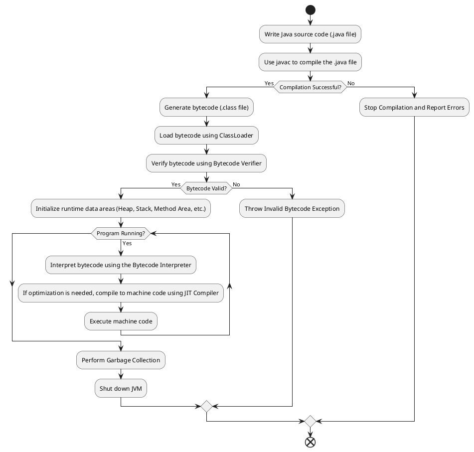

# **JVM (Java Virtual Machine) và JDK (Java Development Kit)**

[English below](#english)

---

## **1. JVM (Java Virtual Machine)**

### **Định nghĩa:**
- JVM (Java Virtual Machine) là **một máy ảo** cho phép máy tính thực hiện các chương trình Java. Nó chịu trách nhiệm chạy chương trình Java bằng cách **dịch mã bytecode (mã trung gian)** được biên dịch từ mã nguồn Java (file `.class`) sang mã máy mà CPU có thể hiểu và thực thi.

### **Vai trò của JVM:**
- Chạy các chương trình Java trên nhiều nền tảng (Windows, Linux, macOS, v.v.) mà không cần thay đổi mã nguồn, nhờ vào khả năng **"Write Once, Run Anywhere."**
- Quản lý bộ nhớ tự động thông qua **Garbage Collection.**
- Đảm bảo tính bảo mật của chương trình Java bằng cách thực hiện kiểm tra bytecode trước khi thực thi.

### **Các thành phần chính của JVM:**
1. **Classloader:** 
   - Chịu trách nhiệm load các tệp `.class` (mã bytecode) vào bộ nhớ JVM.
2. **Bytecode Interpreter:**
   - Phiên dịch mã bytecode và thực thi nó từng bước.
3. **Just-In-Time Compiler (JIT):**
   - Biên dịch mã bytecode thành mã máy (machine code) để tăng hiệu suất.
4. **Runtime Data Areas:**
   - **Heap:** Nơi lưu trữ các đối tượng và các biến toàn cục.
   - **Stack:** Lưu trữ các biến cục bộ và các lời gọi hàm cho mỗi luồng (thread).
   - **Method Area (MetaSpace):** Lưu thông tin về các lớp và phương thức.
   - **Program Counter (PC):** Giữ track vị trí hiện tại mà JVM đang chạy.
   - **Native Method Stack:** Hỗ trợ các lời gọi đến các hàm native (nền tảng nơi JVM chạy).

---

## **2. JDK (Java Development Kit)**

### **Định nghĩa:**
- JDK (Java Development Kit) là **bộ công cụ phát triển Java**, bao gồm tất cả các thành phần cần thiết để viết, biên dịch và chạy các chương trình Java.
  
### **Các thành phần chính của JDK:**
1. **JRE (Java Runtime Environment):**
   - Phần cần thiết để chạy các chương trình Java và chứa JVM.
2. **Compiler (javac):**
   - Công cụ để biên dịch mã nguồn Java (`.java`) thành bytecode (`.class`).
3. **Công cụ phát triển:**
   - **Debugger (jdb):** Dùng để gỡ lỗi.
   - **Archiver (jar):** Đóng gói tệp Java vào tệp `.jar`.
   - **Documentation Generator (javadoc):** Dùng để tự động tạo tài liệu từ mã nguồn.
4. **Thư viện Java:**
   - Bao gồm các API được sử dụng phổ biến như `java.lang`, `java.util`, `java.io`, và nhiều hơn nữa.

---

## **3. Cách Hoạt Động của JVM**

Mô tả cách JVM thực thi một chương trình Java:

1. **Biên dịch mã nguồn Java:**
   - Compile file `.java` bằng **Java Compiler (javac)**.
   - Kết quả là file `.class` (bytecode).
2. **Tải Bytecode vào JVM:**
   - `ClassLoader` nạp file `.class` vào bộ nhớ.
3. **Kiểm tra Bytecode:**
   - `Bytecode Verifier` kiểm tra tính hợp lệ và bảo mật của bytecode.
4. **Thực thi Bytecode:**
   - JVM thực thi bytecode:
     - Sử dụng **Bytecode Interpreter** để dịch bytecode thành mã máy.
     - Sử dụng **JIT Compiler** để biên dịch bytecode thành mã máy trước khi chạy (trong runtime) và cải thiện hiệu suất.
5. **Quản lý Tài nguyên Hệ Thống:**
   - JVM quản lý bộ nhớ, bao gồm cấp phát và thu hồi bộ nhớ (Garbage Collection).

Dưới đây là quá trình làm việc của JVM được thể hiện qua sơ đồ hoặt động:

---

## **4. PlantUML - Activity Diagram Cho Cơ Chế Hoạt Động của JVM**

---

## **5. Giải Thích Sơ Đồ Hoạt Động của JVM**

1. **Viết mã nguồn Java:** 
   - Lập trình viên viết mã Java và lưu lại dưới dạng file `filename.java`.
2. **Biên dịch mã nguồn:** 
   - `javac` sẽ biên dịch mã nguồn thành bytecode (file `.class`). Nếu quá trình biên dịch bị lỗi, quá trình dừng lại và trả lỗi.
3. **Nạp Bytecode:** 
   - Khi người dùng chạy chương trình Java (`java filename`), `ClassLoader` sẽ nạp file `.class` vào bộ nhớ JVM.
4. **Xác minh Bytecode:** 
   - `Bytecode Verifier` kiểm tra mã bytecode để đảm bảo rằng nó không có hành vi bất hợp pháp hoặc độc hại.
5. **Thực thi chương trình:**
   - JVM ban đầu sử dụng **Bytecode Interpreter** để thực thi mã bytecode.
   - Nếu mã bytecode được gọi nhiều lần, **JIT Compiler** tối ưu hóa hiệu suất bằng cách biên dịch Bytecode thành mã máy (Machine Code).
6. **Quản lý bộ nhớ:**
   - JVM tự động quản lý bộ nhớ bằng **Garbage Collector**, loại bỏ các đối tượng không còn cần thiết.
7. **Kết thúc chương trình:** 
   - Khi chương trình Java kết thúc, JVM giải phóng các tài nguyên và tắt máy ảo.

---

## **6. Tóm Tắt**

| **Thành phần**  | **JVM**                                         | **JDK**                                                                                         |
|-----------------|-------------------------------------------------|-------------------------------------------------------------------------------------------------|
| **Mục đích**    | Chạy ứng dụng Java.                            | Cung cấp các công cụ để phát triển Java, bao gồm trình biên dịch (compiler), JVM và thư viện.  |
| **Thành phần**  | ClassLoader, Bytecode Verifier, Runtime Memory. | javac (compiler), javadoc (documentation), jar (archiver), JRE (Java Runtime Environment), JVM.|
| **Vai trò**     | Thực thi bytecode sang mã máy trong runtime.    | Biên dịch mã Java và thực thi nó sau đó qua JVM.                                               |

JVM và JDK là những thành phần cốt lõi trong hệ sinh thái Java, hoạt động đồng bộ để cung cấp môi trường lập trình và thực thi mạnh mẽ cho các nhà phát triển.

---
# English:

# **What is JVM and JDK? How JVM Works?**

---

## **1. JVM (Java Virtual Machine)**

### **Definition:**
- JVM (Java Virtual Machine) is **a virtual machine** that enables computers to execute Java programs. It is responsible for running Java programs by **translating bytecode (intermediate code)** compiled from Java source code into machine code that can be understood and executed by the CPU.

### **Role of JVM:**
- Runs Java programs across different platforms (Windows, Linux, macOS, etc.) without modifying the code, thanks to the **"Write Once, Run Anywhere"** principle.
- Manages memory automatically through **Garbage Collection.**
- Ensures the security of Java programs by verifying the bytecode before execution.

### **Main Components of JVM:**
1. **Classloader:** 
   - Loads `.class` files (bytecode) into JVM memory.
2. **Bytecode Interpreter:**
   - Interprets and executes bytecode step by step.
3. **Just-In-Time (JIT) Compiler:**
   - Converts bytecode into machine code for better performance at runtime.
4. **Runtime Data Areas:**
   - **Heap:** Stores objects and global variables.
   - **Stack:** Stores local variables and method calls for each thread.
   - **Method Area (MetaSpace):** Stores information about classes and methods.
   - **Program Counter (PC):** Tracks the current instruction being executed.
   - **Native Method Stack:** Supports calls to native system-level methods.

---

## **2. JDK (Java Development Kit)**

### **Definition:**
- JDK (Java Development Kit) is **a development toolkit for Java** that includes all the necessary tools to write, compile, and run Java programs.

### **Main Components of JDK:**
1. **JRE (Java Runtime Environment):**
   - Provides the essential components needed to run Java programs, including JVM.
2. **Compiler (`javac`):**
   - Converts Java source code (`.java`) into bytecode (`.class`).
3. **Developer Tools:**
   - **Debugger (`jdb`):** Debugging tool for Java programs.
   - **Archiver (`jar`):** Tool to package Java files into `.jar` files.
   - **Documentation Generator (`javadoc`):** Automatically generates documentation from source code.
4. **Java Libraries:**
   - Includes commonly used APIs such as `java.lang`, `java.util`, `java.io`, and many others.

---

## **3. How JVM Works**

Here is a step-by-step explanation of how JVM executes a Java program:

1. **Java Source Code Compilation:**
   - The Java source code (`.java file`) is compiled by **Java Compiler (javac)** into bytecode (`.class file`).
2. **Loading Bytecode into JVM:**
   - `ClassLoader` loads the `.class` file into JVM memory.
3. **Verifying Bytecode:**
   - `Bytecode Verifier` checks that the bytecode is valid and secure before execution.
4. **Executing Bytecode:**
   - JVM executes the bytecode using:
     - **Bytecode Interpreter** to translate bytecode into machine-understandable instructions.
     - **JIT Compiler** optimizes performance by compiling frequently executed bytecode into machine code at runtime.
5. **System Resource Management:**
   - JVM manages resources like memory using **Garbage Collection**, which automatically removes unused objects to free memory.

Below is the working mechanism of JVM represented through an activity diagram:

---

## **4. PlantUML - Activity Diagram for JVM Workflow**

---

## **5. Explanation of JVM Workflow Activity Diagram**

1. **Write Java Source Code:**
   - The developer writes Java code and saves it as a file named `filename.java`.
2. **Compile the Source Code:**
   - The `javac` compiler translates the source code into bytecode, producing a `.class file`. If the compilation fails, an error is thrown, and the process stops.
3. **Load Bytecode:**
   - When the user runs the Java program (`java filename`), the `ClassLoader` loads the `.class` file into JVM memory.
4. **Verify Bytecode:**
   - The `Bytecode Verifier` ensures that the bytecode is valid and safe to execute (e.g., no illegal instructions or memory issues).
5. **Execute the Program:**
   - Initially, the JVM uses **Bytecode Interpreter** to execute bytecode instruction by instruction.
   - To enhance performance, the **JIT Compiler** converts repetitive or hot-spot bytecode into machine code for faster execution.
6. **Manage Memory:**
   - JVM automatically manages memory via **Garbage Collection**, which frees unused objects.
7. **End the Program:**
   - JVM releases resources and shuts down when the program finishes execution.

---

## **6. Summary**

| **Component**       | **JVM**                                                                 | **JDK**                                                                                           |
|---------------------|-------------------------------------------------------------------------|---------------------------------------------------------------------------------------------------|
| **Purpose**          | Runs Java programs.                                                    | Provides tools to develop Java programs, including a compiler (`javac`), JVM, and libraries.      |
| **Components**       | ClassLoader, Bytecode Verifier, Runtime Memory.                        | `javac` (compiler), `javadoc` (documentation), `jar` (archiver), `JRE` (Java Runtime Environment), JVM. |
| **Role**             | Executes bytecode by translating it into machine code at runtime.      | Compiles Java source code and provides tools to run and debug Java programs.                     |

JVM and JDK are integral parts of the Java ecosystem, working together to provide a robust environment for developing and running Java applications. Understanding how JVM works is crucial for optimizing Java programs and improving overall performance.
