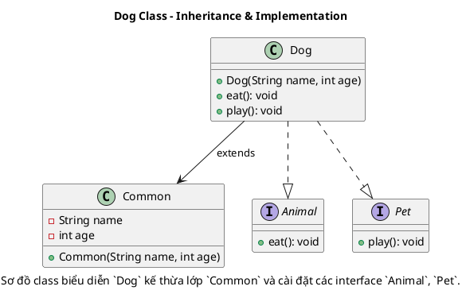
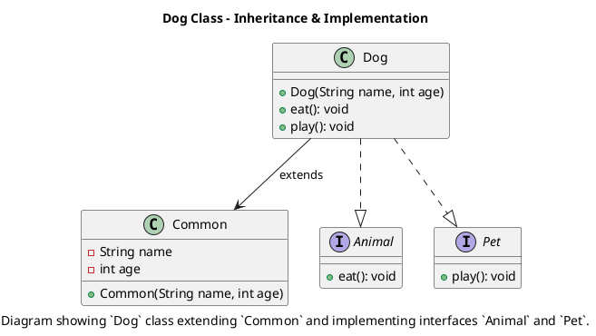

# Multiple Inheritance

[English below](#english)

### Giải thích:
- **Superclass Common**:
  - Là lớp cha (superclass) mà `Dog` kế thừa.
  - Bao gồm:
    - Thuộc tính private `name` và `age`.
    - Phương thức khởi tạo (constructor): `Common(String name, int age)`.

- **Interface Animal** và **Interface Pet**:
  - `Animal`: Định nghĩa phương thức `eat()`.
  - `Pet`: Định nghĩa phương thức `play()`.

- **Subclass Dog**:
  - Kế thừa `Common`.
  - Cài đặt (implements) các interface `Animal` và `Pet`.
  - Phương thức `Dog(String name, int age)` gọi constructor của `Common` qua từ khóa `super`.
  - Ghi đè (override) hai phương thức:
    - `eat()` từ `Animal`.
    - `play()` từ `Pet`.

- **Quan hệ**:
  - `Dog --> Common`: Thể hiện `Dog` kế thừa từ `Common`.
  - `Dog ..|> Animal` và `Dog ..|> Pet`: Thể hiện `Dog` cài đặt hai interface `Animal` và `Pet`.

---

# English:

### Class Diagram Explanation:

### Explanation:
- **Superclass Common**:
  - This is the parent class that `Dog` extends.
  - Includes:
    - Private attributes `name` and `age`.
    - Constructor `Common(String name, int age)`.

- **Interfaces Animal and Pet**:
  - `Animal`: Defines the method `eat()`.
  - `Pet`: Defines the method `play()`.

- **Subclass Dog**:
  - Inherits from `Common`.
  - Implements (or realizes) `Animal` and `Pet` interfaces.
  - The constructor `Dog(String name, int age)` calls the parent class constructor using `super`.
  - Overrides two methods:
    - `eat()` from `Animal`.
    - `play()` from `Pet`.

- **Relationships**:
  - `Dog --> Common`: Represents that `Dog` extends from `Common`.
  - `Dog ..|> Animal` and `Dog ..|> Pet`: Represents that `Dog` implements `Animal` and `Pet`.

Paste this PlantUML code into [PlantText](https://planttext.com/) or similar tools to generate the class diagram.
