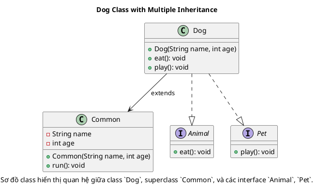
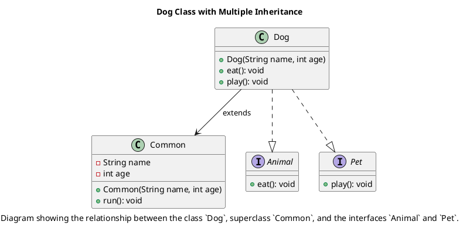

# Class Diagram for `Dog` Class

[English below](#english)

### Giải thích:

- **Superclass Common**:
  - Đây là lớp cơ bản mà `Dog` kế thừa.
  - `Common` có các thuộc tính `name` và `age`, cùng với constructor `Common(String name, int age)` và phương thức `run()` (giả sử lớp này có phương thức như vậy).

- **interface Animal** và **interface Pet**:
  - `Animal` định nghĩa phương thức `eat()`.
  - `Pet` định nghĩa phương thức `play()`.

- **class Dog**:
  - Là lớp kế thừa (extends) từ `Common`.
  - Đồng thời, nó cài đặt (implements) các interface `Animal` và `Pet`.
  - Lớp này override các phương thức `eat()` từ `Animal` và `play()` từ `Pet`.

- **Quan hệ**:
  - Ký hiệu `-->` thể hiện rằng `Dog` kế thừa lớp `Common`.
  - Ký hiệu `..|>` thể hiện rằng `Dog` cài đặt (implements) các interface `Animal` và `Pet`.

---

# English:

### Class Diagram Explanation:

### Explanation:

- **Superclass Common**:
  - This is the base class that `Dog` extends from.
  - It contains the attributes `name` and `age`, a constructor `Common(String name, int age)`, and possibly other methods like `run()`.

- **interface Animal** and **interface Pet**:
  - The `Animal` interface defines the method `eat()`.
  - The `Pet` interface defines the method `play()`.

- **class Dog**:
  - This class extends from `Common`.
  - It also implements the `Animal` and `Pet` interfaces.
  - The `Dog` class overrides the methods `eat()` from `Animal` and `play()` from `Pet`.

- **Relationships**:
  - The `-->` symbol indicates that `Dog` extends from the `Common` class.
  - The `..|>` symbol indicates that `Dog` implements the `Animal` and `Pet` interfaces.

Copy and paste the PlantUML code into a tool like [PlantText](https://planttext.com/) to visualize the diagram.
